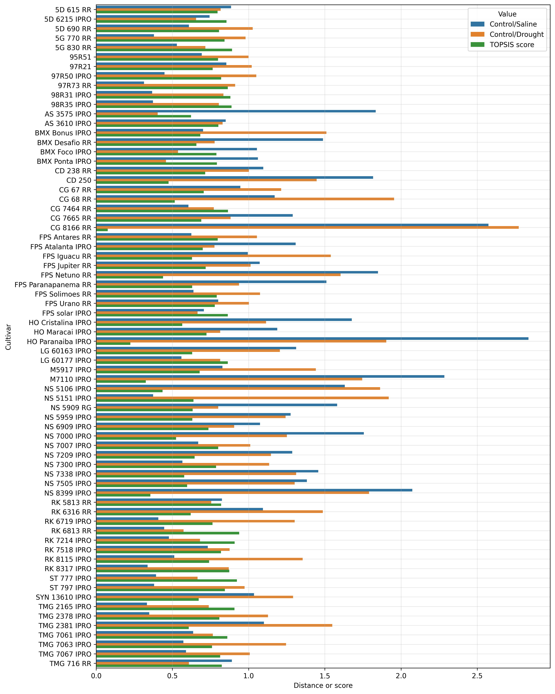

# Selection of soybean genotypes subjected to drought and salt stress using Manhattan distance and TOPSIS

**Authors:** Bruno Rodrigues de Oliveira (1), Alan Mario Zuffo (2), Jorge González Aguilera (3), Fábio Steiner (4)

**Corresponding author:** bruno@editorapantanal.com.br

1 Pantanal Editora, Rua Abaete, 83, Sala B, Centro. Nova Xavantina-MT, Brasil.

2 Departamento de Agronomia, Universidade Estadual do Maranhão (UEMA), Praça Gonçalves Dias, Balsas-MA, Brasil.

3 Departamento de Agronomia, Universidade Federal de Mato Grosso do Sul (UFMS), Chapadão do Sul-MS, Brasil.

4 Departamento de Agronomia, Universidade Estadual de Mato Grosso do Sul (UEMS), Unidade de Cassilândia, Rodovia MS 306 - km 6,4, Cassilândia-MS, Brasil.

**Abstract**
The search for soybean genotypes more adapted to the adverse conditions of the production fields is essential to boost the development and yield of the crop in Brazil and worldwide. In this research, we propose a new approach to how the concept of distance (or similarity) in a vector space can be used to quantify changes in the morphological traits of soybean seedlings exposed to drought and saline stress environments. Thus, this study was carried out to select soybean genotypes exposed to stressful environments (saline or drought) using similarity based on Manhattan distance and the TOPSIS method. Drought and saline stresses were induced by exposing seeds of 70 soybean genotypes to −0.20 MPa iso-osmotic solutions with polyethylene glycol - PEG 6000 (119.6 g/L) or NaCl (2.36 g/L) for 14 days at 25°C. The germination rate, seedling length and seedling dry matter were measured. We showed here how genotypic stability of soybean plants can be quantified by TOPSIS method when comparing drought and salinity conditions in relation to non-stressful environment (control) and how this method can be employed under different conditions. Based on the TOPSIS method, we can select the best soybean genotypes for environments with multiple abiotic stresses. Among the 70 tested soybean genotypes, RK 6813 RR, ST 777 IPRO, RK 7214 IPRO, TMG 2165 IPRO, 5G 830 RR, 98R35 IPRO, 98R31 IPRO, RK 8317 IPRO, CG 7464 RR and LG 60177 IPRO are the 10 most stable genotypes under drought and saline stress conditions. Owing to high stability and gains with selection verified for these genotypes under salinity and drought conditions, they can be used as genitors in breeding programs aimed at obtaining offspring with higher resistance to antibiotic stresses.

